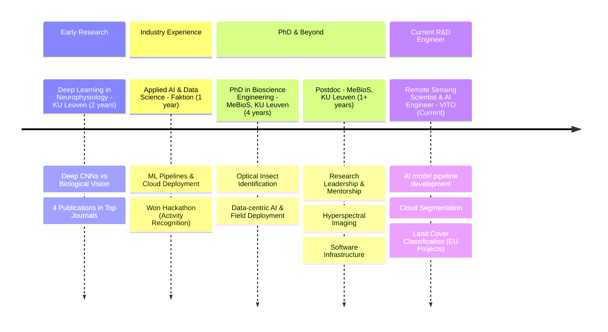

# 🤖 AI Engineer & Machine Learning Research Scientist  

> *Bridging the gap between cutting-edge research and real-world impact*

*For a summary of links to various online profiles, you can check out my [linktree](https://linktr.ee/kalfasyan).*

## 🎯 About Me

I'm a **multidisciplinary computational scientist** at the intersection of AI, Machine Learning, and Bioscience Engineering, with **10+ years of combined experience** across academia, industry, and R&D environments.  
  
**💼 My professional journey**: My professional journey encompasses end-to-end ML pipeline development, cloud-based AI deployment, and strategic AI implementation in production environments, with a consistent focus on driving meaningful technological advancements that address real-world challenges.

```
🧠 Neurophysiology  →  🚀 Industry AI  →  🐞 Agricultural AI  →  🛰️ Earth Observation
   Lab Research         Applied Solutions     Field Applications    Global Monitoring
```
**🌍 Currently Working On**: I'm developing AI models for the **[Land Cover and Forest Monitoring (LCFM)](https://land.copernicus.eu/en/news/lcfm-a-new-chapter-in-global-land-cover-monitoring)** project at Vito, part of the EU's Copernicus programme, in the team that released the famous [ESA WorldCover products](https://esa-worldcover.org/en). My work involves building multi-stage AI pipelines that process satellite data to create global land cover maps at unprecedented 10m resolution—a tenfold improvement over previous products. I specialize in training cloud segmentation models for quality signal identification, maintaining our code repositories on github (soon to be open-sourced), and deploying classification models that generate annual land cover maps for the entire planet, directly supporting EU environmental policy and climate monitoring initiatives.

```
🛰️ Satellite Data → ☁️ AI Cloud Detection → 📊 Quality Composites → 🗺️ Global Land Cover Maps
                                    10m Resolution • Annual Updates • Planetary Scale
```
                      

## Contact

🌱 I'm always interested to learn about how Artificial Intelligence can improve our lives.  
💬 Do you want to reach out? Send an email at kalfasyan[at]gmail[dot]com  
🔗 Check my [linktr.ee](https://linktr.ee/kalfasyan)  
  
📚 Researcher profiles:  
🧬 [orcid](https://orcid.org/0000-0002-9957-1502)  
🔬 [scholar](https://scholar.google.com/citations?user=WXHakDkAAAAJ&hl=en)  
📖 [researchgate](https://www.researchgate.net/profile/Ioannis-Kalfas-2)  
  
🌐 Stay connected through the following social media channels: [bluesky](https://bsky.app/profile/kalfasyan.bsky.social), [linkedin](https://www.linkedin.com/in/kalfasyan/), [github](https://github.com/kalfasyan/)  
  
----

### 📊 GitHub Analytics & Activity

<div align="center">

<!-- GitHub Stats -->


<!-- GitHub Streak Stats -->


</div>
   

### 🌐 Open Source Contributions 
Keywords: *Web Development, CLI Tools, DevOps, Computer Vision, Image Processing, IoT, Python, Flask, NiceGUI, Solara, Streamlit*

**[`desto`](https://github.com/kalfasyan/desto)** - Web dashboard and CLI for managing scripts in tmux sessions  
 
- Full-stack web application with real-time system monitoring, live log viewing, script scheduling, and both web interface and command-line functionality.
- Built with modern web technologies and Docker deployment, showcasing full-stack development skills beyond core AI/ML expertise.

**[`plakakia`](https://github.com/kalfasyan/plakakia)** - Python image tiling library for computer vision tasks  
 
- High-performance image tiling tool for object detection and segmentation datasets, utilizing multiprocessing and numpy for efficient processing.
- Features online/offline processing modes, bounding box handling, duplicate removal, and a Streamlit demo interface.
- Benchmarked on multiple public datasets with comprehensive performance metrics and extensive documentation.

**[`Home_Surveillance_with_Python`](https://github.com/kalfasyan/Home_Surveillance_with_Python)** - Motion detection surveillance system  

- Complete IoT surveillance solution using OpenCV for motion detection, Flask for web streaming, and Pushbullet API for mobile alerts.
- Raspberry Pi compatible with picamera support, demonstrating practical IoT deployment and computer vision integration.
- Features real-time video streaming, automated alerting, and image capture with motion region highlighting.
    
<p align="center">
  <a href="https://skillicons.dev">
    
  </a>
</p>

----
## Background
  
### 🎓 Studies 
Keywords: *Python Programming, Artificial Neural Networks, Spiking Neural Networks, Machine Learning*  
  
- Earned a Bachelor's degree in Computer Science at Aristotle University of Thessaloniki (Greece 🇬🇷), building a solid foundation in computing theory.
- Completed a Master's degree in [Machine Learning at KTH University](https://www.kth.se/en/studies/master/machine-learning) (Stockholm, Sweden 🇸🇪), specializing in Computational Neuroscience and Spiking Neural Networks.
- Conducted [thesis](https://kth.diva-portal.org/smash/record.jsf?pid=diva2%3A868833&dswid=-157) research simulating neocortical structures using the [NEST simulator in Python](https://nest-simulator.readthedocs.io/en/stable/index.html) to compare various [columnar structure types](https://en.wikipedia.org/wiki/Cortical_column) and their activity patterns.
- Pursued additional research in a neurophysiology lab, exploring computational neuroscience applications.
- Obtained a PhD degree in Bioscience Engineering, transitioning research focus to optical insect identification using artificial intelligence.

### :briefcase: Professional Experience  

#### Deep Learning in Neurophysiology at KUL (PhD researcher) 🧠  
Keywords: *Brain-Inspired AI, Visual System Research, Neural Activity Prediction, Computer Vision, Scientific Publishing*  
  
- Conducted in-depth studies on deep Convolutional Neural Networks and their resemblance to biological visual systems at the [lab of Neurophysiology of KU Leuven](https://gbiomed.kuleuven.be/english/research/50000666/50000669/50488669) for 2 years.
- Developed advanced computer vision and regression models to predict biological neuronal activity based on artificial neuron activations from state-of-the-art CNN architectures.
- Published 4 scientific papers in renowned neuroscience journals ([[1]](https://www.eneuro.org/content/4/3/eneuro.0113-17.2017.abstract)[[2]](https://journals.plos.org/ploscompbiol/article?id=10.1371/journal.pcbi.1006557)[[3]](https://www.jneurosci.org/content/39/33/6513.abstract)[[4]](https://www.frontiersin.org/articles/10.3389/fnhum.2017.00402/full)) and presented research at [VSS conference](https://jov.arvojournals.org/article.aspx?articleid=2651681) (Florida, USA).

#### Applied AI at Faktion (Data Scientist) 🚀  
Keywords: *Practical Industry AI Solutions, Machine Learning Pipelines, Computer Vision, Cloud Technology, Hackathons*  
  
- Transitioned from fundamental research to applied AI applications to create measurable societal impact through industry-focused solutions.
- Developed expertise in end-to-end ML pipelines, AI model training, Docker containerization, and cloud deployment while working as a Data Scientist at [Faktion](https://faktion.com/) in Antwerp.
- Won first place in a [hackathon on Activity Recognition](https://faktion.com/blog/human-activity-capturer-and-klassifier-wins-first-prize-at-vinci-energies-hackaton/) in video data, organized by Vinci Energies.

#### Data-centric AI at MeBioS, KUL (PhD researcher) 🐞  
Keywords: *Insect Recognition, Optical Sensors, Smart Monitoring Systems, Computer Vision, Sound Pattern Analysis, EU Projects, IoT Devices, Cloud Services*  
  
- Completed PhD in Bioscience Engineering focusing on [Optical Insect Identification using Artificial Intelligence](https://kuleuven.limo.libis.be/discovery/fulldisplay?docid=lirias3887120&context=SearchWebhook&vid=32KUL_KUL:Lirias&lang=en&search_scope=lirias_profile&adaptor=SearchWebhook&tab=LIRIAS&query=any%2Ccontains%2CLIRIAS3887120&offset=0), developing two distinct recognition approaches: image-based computer vision ([repo1](https://github.com/kalfasyan/photobox), [repo2](https://github.com/kalfasyan/photobox_app), [repo3](https://github.com/kalfasyan/stickybugs-ai)) and time-series wingbeat signal processing ([repo1](https://github.com/kalfasyan/wbai), [repo2](https://gitlab.kuleuven.be/mebios-dl/research/3e200920/flying_insect_trap)).
- Specialized in data-centric AI and rigorous model validation methodologies to ensure reliable performance in real-world field deployments.
- Built comprehensive software ecosystem including GUIs (Streamlit, Tkinter) and AI models (YOLO, R-CNN, 2-stage detectors) deployed across IoT devices, desktop systems, and cloud infrastructure (AWS).
- Developed and maintained a production API server on AWS serving image classification models to external companies and research institutes ([demo1](https://www.veed.io/view/5147995d-7dad-44e0-b3c7-fd91f16699f0?panel=showcase), [demo2](https://www.veed.io/view/8efbeae2-e421-456a-9b50-30c968bcdf3e?panel=showcase)), featuring FastAPI backend and Streamlit-based annotation interface.

#### Postdoctoral Researcher at MeBioS, KUL 🦾  
Keywords: *Research Mentorship, Advanced Imaging, Agricultural Technologies, Software Development, Data Management*  
  
- Led multiple AI projects in insect monitoring and agrifood applications while mentoring PhD researchers and developing research-supporting software tools.
- Advanced expertise in Hyperspectral Imaging (HSI) techniques, applying state-of-the-art methods for complex hypercube data analysis.
- Served as research data and software manager, overseeing infrastructure for data/software sharing and maintaining the research group's [GitLab organization](https://gitlab.kuleuven.be/mebios-dl).
- Created the [`plakakia`](https://github.com/kalfasyan/plakakia) image tiling library to support researchers with image processing and object detection workflows.

#### Remote Sensing & AI Researcher at Vito 🛰️  
Keywords: *Earth Observation, Environmental Monitoring, EU Projects, Sustainable Development, Geospatial Analysis, Cloud Services, Hadoop, Spark, AWS*  
  
- Develop reliable earth land cover classification systems through the [LCFM project of the EU commission (JRC)](https://remotesensing.vito.be/services/copernicus-lcfm), building upon successful [ESA Worldcover products](https://esa-worldcover.org/en).
- Apply hyperspectral satellite data analysis, computer vision techniques, and machine learning models to interpret complex environmental datasets for conservation, land use planning, and climate change mitigation applications.
- Contribute to innovative solutions for planetary resource monitoring and management through advanced geospatial AI technologies.

For an overview of Land Cover Mapping projects and their applications, see this comprehensive [blog post](https://landcarbonlab.org/insights/global-land-cover-maps-accuracy-applications/) by the Land Carbon Lab.  

  
